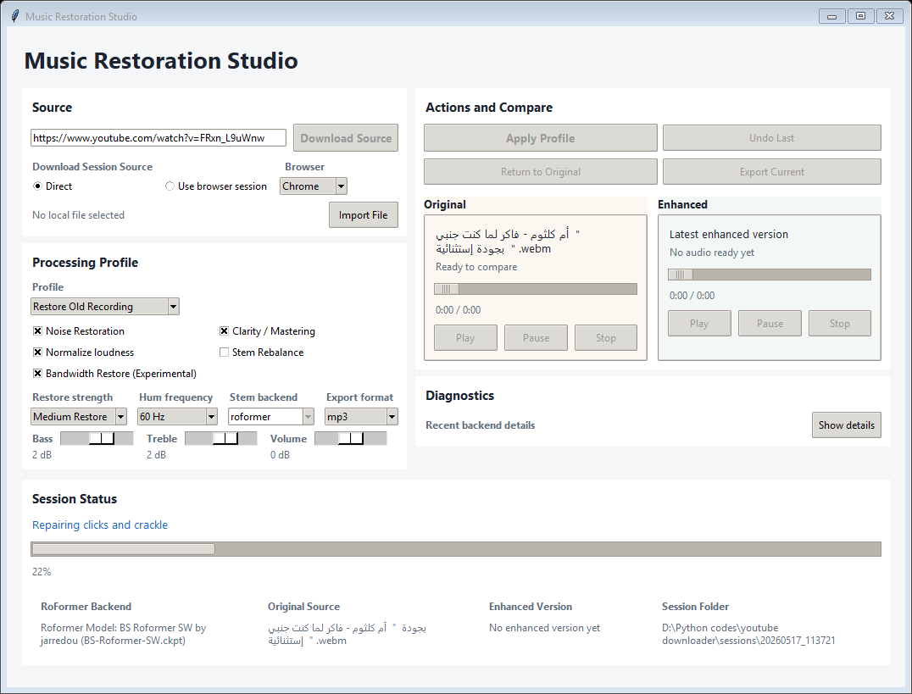

# Music Restoration Studio

Desktop app for downloading or importing songs, preserving the untouched source, and creating versioned restored or enhanced results for A/B comparison.

The current main app is a compact **Tkinter desktop interface** built around music restoration:
- old songs with hiss, hum, clicks, rumble, or dull top-end
- compressed or bandwidth-limited audio that needs careful enhancement
- before/after comparison with non-destructive undo

## UI Preview



## Main App

Run the desktop app:

```powershell
.\.venv\Scripts\python.exe restoration_studio_tk.py
```

## Workflow

1. Download from YouTube or import a local file
2. Play the original source
3. Pick a processing profile
4. Apply restoration or enhancement
5. Compare original vs enhanced
6. Undo or export

## Profiles

- `Restore Old Recording`
  - restoration-first flow
  - staged de-hum, declick, and hiss reduction
  - restore strength presets
  - 50 Hz / 60 Hz hum control
  - optional RoFormer stem rebalance
  - optional experimental bandwidth restore
  - conservative mastering at the end

- `Enhance Song`
  - mastering-first flow for already-decent songs
  - optional RoFormer rebalance

- `Stem Rebalance`
  - RoFormer-led vocal and instrumental rebalance
  - avoids restoration-heavy defaults

- `Advanced / Experimental`
  - exposes AudioSR
  - exposes legacy Demucs fallback
  - keeps manual tone controls available

## Core Capabilities

- YouTube source download via `yt-dlp`
- browser-session download mode for tougher YouTube 403 cases
- local file import
- original and enhanced playback with seek controls
- versioned enhancement history with undo
- WAV working master during processing
- export current result as `MP3`, `WAV`, or `FLAC`
- RoFormer-family stem rebalance through `audio-separator`

## Experimental Capabilities

- AudioSR bandwidth restoration
- Demucs legacy fallback for stem rebalance


## Install

Install core requirements:

```powershell
.\.venv\Scripts\python.exe -m pip install -r requirements.txt
```

AudioSR stays in its own environment:

```powershell
python -m venv .venv_audiosr
.\.venv_audiosr\Scripts\python.exe -m pip install -r requirements-audiosr.txt
```

Optional heavier AI extras:

```powershell
.\.venv\Scripts\python.exe -m pip install audio-separator onnxruntime
```

## Tests

Run the backend smoke suite:

```powershell
.\.venv\Scripts\python.exe test_restoration_studio_backend.py --suite quick
```

Model-resolution check:

```powershell
.\.venv\Scripts\python.exe test_restoration_studio_backend.py --suite models
```

The tests generate their own synthetic audio input. No bundled music file is required.

## Repository Notes

- Generated sessions, model caches, virtual environments, and test outputs should not be committed.
- The app keeps the downloaded or imported source file as the true original.
- Each enhancement creates a new lossless WAV version in the session history.
- Export happens only when requested.
- AudioSR remains experimental and can change timbre.
- The backend reserves a future slot for Apollo-style compression restoration, but Apollo is not integrated yet.
- The codebase is organized around:
  - [restoration_studio_tk.py](<D:\Python codes\youtube downloader\restoration_studio_tk.py>) as the app entrypoint
  - [restoration_backend.py](<D:\Python codes\youtube downloader\restoration_backend.py>) as the shared processing module
